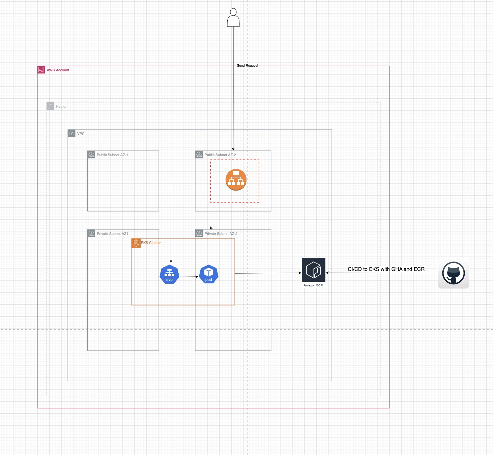

# port-assignment - Shahar Shitrit

# Kubernetes Architecture for Production

This repository contains the infrastructure and deployment configuration for a Kubernetes-based application environment, implemented using Terraform, GitHub Actions, and Kubernetes manifests. Below, we first describe the current architecture as deployed in this proof of concept (POC), followed by suggestions to evolve it into a production-ready environment.

---

## Current Architectural Solution

The current architecture leverages **Terraform** to provision and manage cloud resources, ensuring scalable, reliable, and consistent infrastructure. The Terraform configurations in the `terraform` folder define core network components like VPCs, subnets, and security groups, establishing a secure and structured network foundation. Public and private subnets isolate essential resources such as load balancers while securing internal services, following Infrastructure as Code (IaC) best practices for maintainability.

**GitHub Actions** workflows, located in `.github/workflows/`, automate CI/CD tasks by running tests, applying Terraform changes, and monitoring deployments. This setup reduces manual intervention, accelerating deployments and ensuring consistency. The Kubernetes manifests in the `manifests` directory are configured for application components, defining pods, services, and ingress rules that manage traffic and ensure service availability. Together, these tools enable a scalable and efficient deployment process suitable for a POC.

---

## Current Architecture Diagram

---

## Moving from POC to Production-Ready

To move this architecture into a production-ready environment, implement high availability, redundancy, and autoscaling. Deploy resources across multiple availability zones with autoscaling policies to handle variable traffic loads. Configure **AWS Application Load Balancer (ALB)** for SSL termination and use path-based routing to manage secure traffic distribution to Kubernetes services. Health checks on the ALB ensure that only healthy pods receive traffic, boosting service reliability.

For DNS, integrate **Route 53** to manage domain resolution. Route 53 public zones handle external domain records for the ALB, while private zones secure internal services. Using **external-dns** automates DNS updates in Route 53, dynamically adjusting records as service changes occur, simplifying management and reducing operational overhead.

Implement **Horizontal Pod Autoscaler (HPA)** to dynamically adjust pod replicas based on workload, ensuring efficient resource use. For node-level scaling, use **Karpenter**, which manages EC2 instance provisioning and de-provisioning based on workload demand, optimizing costs and capacity. Additionally, configure **readiness and liveness probes** in Kubernetes manifests to monitor the health of application containers. Liveness probes detect and restart unhealthy containers, while readiness probes confirm that containers are ready to serve traffic, preventing requests from being sent to unready instances. Lastly, integrate **ArgoCD** as a GitOps tool for continuous delivery, monitoring manifest changes and syncing them to the Kubernetes cluster, enhancing deployment consistency and enabling efficient rollback capabilities.

---

## Summary

By implementing these enhancements, this architecture will evolve into a production-ready solution, combining Terraform, ALB, Route 53, ArgoCD, HPA, Karpenter, and GitHub Actions to support a scalable, secure, and highly available Kubernetes deployment. These adjustments provide the foundation for a robust production environment, ready to handle high demand and support continuous, automated deployments.
